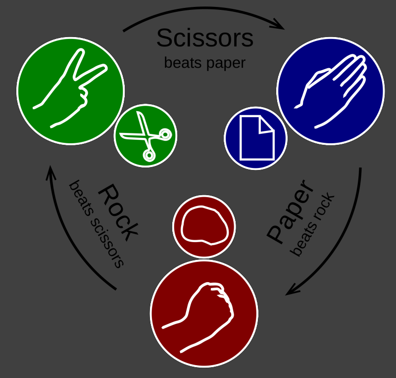

# Rock Paper Scissors

Let's play! You have to return which player won! In case of a draw return `Draw!`.

**Examples(Input1, Input2 --> Output):**
```bash
"scissors", "paper" --> "Player 1 won!"
"scissors", "rock" --> "Player 2 won!"
"paper", "paper" --> "Draw!"
```



---

## Given code
```python
def rps(p1, p2):
    #your code here
```

---

## Solution 1
```python
def rps(p1, p2):
    counters = {"scissors": "paper",
                "paper": "rock",
                "rock": "scissors"}
    
    if p1 == p2:
        return "Draw!"
    elif counters[p1] == p2:
        return "Player 1 won!"
    else:
        return "Player 2 won!"
```

---

- [Click to check challenge in CodeWars](https://www.codewars.com/kata/5672a98bdbdd995fad00000f)
- [Click to check a python sample in this repo](https://github.com/AugustoCarloPareja/codewars_challenges/blob/master/8_kyu/Rock_Paper_Scissors.py)