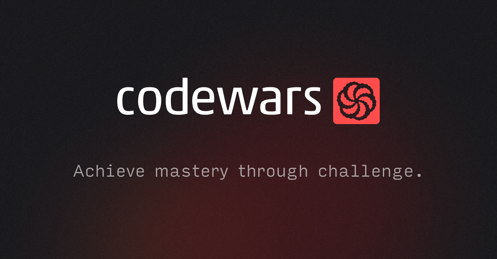

# Codewars challenges solutions

Welcome, codernaut!

In this repository, you will find some solutions for random `python` challenges. 

It will be displayed by folders of rank levels (a.k.a. `Kyu` / `Dan`). As codewars docs says:

```
Ranks are used to indicate the proficiency of users and the difficulty of Kata. There are two classes of ranks, Kyu and Dan, which are divided in 8 levels each. By increasing order of proficiency/difficulty:

-> 8 Kyu to 1 Kyu
-> 1 Dan to 8 Dan

Kyu (or Kyū) indicates the number of degrees away from master level (Dan). This is why they count downward. Once you reach master level, we count upward.
```

Over time, I will be adding more solutions.

You can find some easy challenges, and other more "challenging" ones 😄. Also, over time i will be adding more and more. It's really fun!

Also, feel free to fork and add your own challenges or any suggestions.

Thanks for watching and...

Happy coding! 😎

